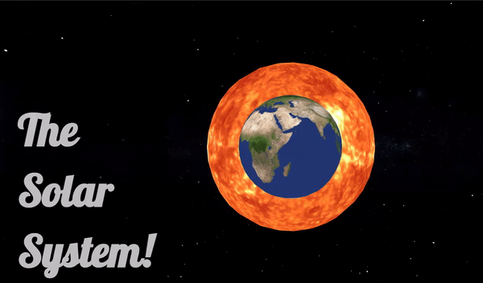

# ThreeJS-Solar-System

This is another of my final year univerity projects. It features the use of ThreeJS, a JavaScript library for perfomrant 3D rendering in the browser,
thanks to it being built on WebGL. As the name suggest, this project offers an educational experience of our Solar System's planets, featuring a few factoids. 

## Running the Project
To run it please do the following:
  1. Download
  ```shell
  git clone https://github.com/MohamedElBakry/ThreeJS-Solar-System.git
  ```
  2. Install the libraries with npm:
  ```shell
  cd ThreeJS-Solar-System
  npm install
  ```
  3. Run with npm:
  ```shell
  npm run dev
  ```
  4. Visit the localhost page at [localhost](http://localhost:3000)
  
  
## Example
Here's a gif of the opening screen:


